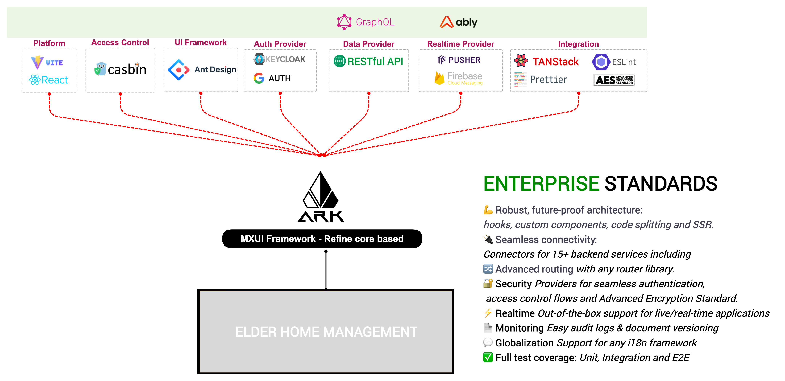

# The Elder's Home Management System (EHMS)


The EHMS project is based on React 18 / Vite 5 with a great deal of latest
FE
technologies, providing better user experience as well as developer has ability to get work done faster and
productivity.

#### <i style="color: green"> Version 0.1-dev </i>

<hr>

## Introduction

### React (18.x)

### Refine

<strong>Build your <a href="https://reactjs.org/">React</a>-based CRUD applications, without constraints.</strong>
<br>An open-source, headless web application framework developed with flexibility in mind.

#### Vite/Rollup/ESBuild, PNPM - Next Generation FE Tools.

###### Why use Vite (ESBuild/Rollup) over Creat React App service?

✅ Also created by Evan You (Vue’s Author), the future of Creat React App with impressive speed in spite of the project scale.

b. Why choose PNPM over NPM?

✅ Speed again (at least 2x faster than the alternative), we prefer a better solution with efficiency. PNPM is a better
replacement for NPM with better speed, small disk, and network usage.

✅ Trusted by a lot of big brands such as Microsoft, Vite…

#### MUI - React-Based UI component libraries

#### Vite-Unplugin - API, components auto import.

#### Rxjs - Reactive for JS.

<hr>

## Developer Guideline

### Prerequisite

Development Environment is Node-based LTS (18.15.0) currently and PNPM as Package Manager.

```json
{
  ehm-front: 'mvp-0.1',
  npm: '9.5.0',
  node: '18.15.0',
  v8: '10.2.154.26-node.25',
  uv: '1.44.2',
  zlib: '1.2.13',
  brotli: '1.0.9',
  ares: '1.18.1',
  modules: '108',
  nghttp2: '1.51.0',
  napi: '8',
  llhttp: '6.0.10',
  uvwasi: '0.0.15',
  acorn: '8.8.2',
  simdutf: '3.1.0',
  undici: '5.20.0',
  openssl: '3.0.8+quic',
  cldr: '42.0',
  icu: '72.1',
  tz: '2022g',
  unicode: '15.0',
  ngtcp2: '0.8.1',
  nghttp3: '0.7.0'
}
```

### Environment

Under `env` folder, create a file with name `.env.local` (already ignored) with below content

```dotenv
EHM_ENV=dev
EHM_SYS_ENV_ENABLED=false
EHM_APP_NAME=EHMS
EHM_APP_URL=
EHM_APP_API_HOST=
EHM_PORT=8686
EHM_PUBLIC_PATH=/
EHM_DOUCI=
```

### Install Project Dependencies

<em>Noted:</em> if you dont have PNPM let install first https://pnpm.io/

`pnpm install` or `pnpm i`

### Start Local Development Server

`pnpm dev`

### Build Production Mode

` pnpm build --mode production`

### Project CodeStyle

We use Prettier to maintain project code-style.

-   To check if any file has problem with code style `pnpm cs`
-   To <strong>check and fix</strong> (use with caution) if any file has problem with code style `pnpm cs`

### Git Configuration

Currently, we use LF(\n) for Line Ending (EOL), project already have Git Attributes file to config it,
in-case it's not, please config for yourself to prevent conflict with other Dev when merge source.

```
git config core.autocrlf = false
git config core.eol = lf
```

<hr>

<pre> Copyright The Ark Studio (c) 2024. End Of File. </pre>
